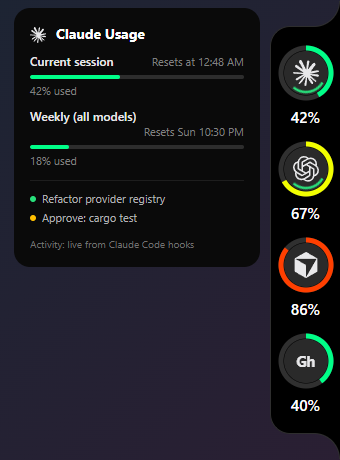
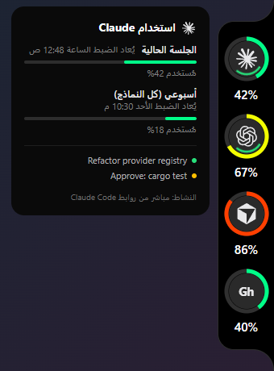

<div align="center">

# Codenotch for Windows

**See how much of every AI coding tool you have left — at the edge of your screen.**

[](https://github.com/hegazy143585/codenotch-windows/actions/workflows/windows.yml)



&nbsp;&nbsp;


### [⬇ Download for Windows](https://github.com/hegazy143585/codenotch-windows/releases/latest/download/Codenotch-Setup.exe)

<sub>Per-user installer · no admin rights · updates itself · <a href="https://github.com/hegazy143585/codenotch-windows/releases">all releases</a></sub>

</div>

---

A small black notch sits on the right edge of your screen. Each ring is one AI tool: the fill is how
much of its limit you have used, the colour turns from green to yellow to red as it runs out, and a
thin inner arc spins while the tool is working or pulses amber when it is waiting for you. Hover it
for the details: every limit window, when it resets, which sessions are running, and how fresh each
number is.

## Features

- **13 providers, one glance** — Claude (Code and Desktop), Codex, Cursor, Antigravity, GitHub Copilot,
  Gemini API, GLM (Z.ai), OpenCode Go, Grok, Command Code, Ollama (local and cloud) and Perplexity.
  Tools you do not have installed never get a cell.
- **Live working state** — exact for Claude Code (through its hooks) and for any tool that reports
  through `codenotch-hook`; estimated from local files for the others, and the card always says which.
- **Honest numbers** — a percentage only when the vendor publishes one, a count when it does not, never
  a made-up reset date. Old readings are marked stale, offline is told apart from an error, and after
  sleep everything refreshes at once.
- **Arabic and English** — the card, the tray and the settings window, right to left in Arabic.
  (Chinese, Japanese and Korean are also included.)
- **Settings window** — show, hide and reorder providers, store keys, connect Perplexity, install the
  Claude Code hooks, start with Windows.
- **Signed auto-update** — checks every 6 hours, verifies the signature, and installs only when you
  click.
- **Stays out of your way** — slides in only when the cursor reaches the screen edge (optional), never
  takes focus, lets clicks through everywhere except the notch.

## Providers

| Provider | Where the numbers come from |
|---|---|
| **Claude** | Claude Code's sign-in (`~/.claude`) and Claude Desktop's own usage samples, whichever is newer |
| **Codex** | Codex's sign-in (`~/.codex/auth.json`), falling back to its latest session log |
| **Cursor** | The editor's own session (its local `state.vscdb`) |
| **Antigravity** | Its local language server, then Google's quota endpoint, then a request count |
| **GitHub Copilot** | GitHub CLI's sign-in (`gh auth login`) |
| **Gemini API** | Token counts from Gemini CLI, OpenCode and Hermes logs on this PC — no network, key never read |
| **GLM (Z.ai)** | The Coding Plan key already set up in Claude Code, ZCode or OpenCode |
| **OpenCode Go** | OpenCode's sign-in |
| **Grok** | Grok CLI's sign-in (`grok login`) |
| **Command Code** | The Command Code app's sign-in |
| **Ollama** | The local Ollama server (loaded models) and, with an API key, Ollama Cloud usage |
| **Perplexity** | A Perplexity window inside Codenotch that you sign into once (tray → Connect Perplexity) |
| **Any other tool** | Working / waiting state through `codenotch-hook --provider <id>` — see [windows/README.md](windows/README.md#reporting-from-any-tool) |

## Privacy

- Everything runs on your PC. Codenotch talks only to each provider's own servers, with the sign-in
  that provider's tool already keeps. There is no Codenotch server, account or telemetry.
- It never shows, logs or sends tokens, keys or cookies. Keys you give Codenotch itself (Ollama Cloud)
  are kept in Windows Credential Manager, not in a file.
- Several providers are read through the same endpoints their own apps use, which are not published
  APIs; they can change without notice, and Codenotch then says the reading failed rather than guess.

## Install

1. Download **[Codenotch-Setup.exe](https://github.com/hegazy143585/codenotch-windows/releases/latest/download/Codenotch-Setup.exe)** and run it. It installs for your user only.
2. Move the cursor to the right edge of your screen.
3. Open **Settings** from the tray icon to choose providers and install the Claude Code hooks.

The installer is not code-signed yet, so Windows SmartScreen may ask you to confirm (**More info → Run
anyway**). Windows 10 or 11 with the WebView2 runtime (built into Windows 11).

## Build from source

```powershell
# Rust (MSVC) and tauri-cli 2: cargo install tauri-cli --version "^2" --locked
cd windows
cargo test --workspace --locked
powershell -ExecutionPolicy Bypass -File scripts\build-installer.ps1
```

Architecture, the provider matrix and the work list are in [`windows/ARCHITECTURE.md`](windows/ARCHITECTURE.md)
and [`windows/TASKS.md`](windows/TASKS.md); releasing is in [`windows/RELEASE.md`](windows/RELEASE.md).

## بالعربية

**Codenotch لنظام Windows** شريط صغير على حافة الشاشة يُظهر كم تبقّى من حدود استخدام أدوات الذكاء الاصطناعي
للبرمجة (Claude وCodex وCursor وGitHub Copilot وغيرها)، ومتى يُعاد ضبطها، وأي أداة تعمل الآن أو تنتظرك.
مرّر المؤشر إلى الحافة اليمنى لرؤية التفاصيل. الواجهة متاحة بالعربية بالكامل من اليمين إلى اليسار — اختر
«العربية» من قائمة اللغة في الدرج أو في الإعدادات. كل شيء يعمل على جهازك، ولا يُرسل أي بيانات إلى أي خادم
غير خوادم الأدوات نفسها.

## Credits

Codenotch for Windows is developed by [hegazy143585](https://github.com/hegazy143585).

It builds on open-source work, all MIT-licensed:

- The Codenotch design and the original macOS app by [vinzdg/codenotch](https://github.com/vinzdg/codenotch).
  Its Swift source is kept in this repository ([`Sources/`](Sources), documented in [MACOS.md](MACOS.md)).
- The first Windows port by [Im-Midi/codenotch-windows](https://github.com/Im-Midi/codenotch-windows), with the
  session engine from [Im-Midi/Pac-Man](https://github.com/Im-Midi/Pac-Man).
- Provider marks from [lobehub/lobe-icons](https://github.com/lobehub/lobe-icons); they remain the trademarks
  of their owners.

## License

MIT — see [`LICENSE`](LICENSE) and [`windows/LICENSE`](windows/LICENSE).
